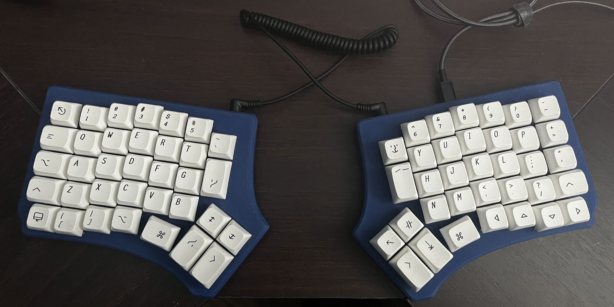

# Redox build

This is a build of the open source redox split keyboard. I struggle with shoulder and wrist pain using typical staggered keyboards and decided to build a split otholinear board. I want to keep this build on a budget so I source the parts myself and ordered the pcbs using the open source files.

### Parts list 

- 70 Gateron yellow switches $21.78 
    https://www.aliexpress.com/item/1005003340518740.html?spm=a2g0o.order_list.order_list_main.30.58691802Kn8lXz
- 2 Push button switches $3.14 
    https://www.aliexpress.com/item/32912263133.html?spm=a2g0o.order_list.order_list_main.25.58691802UwQfo8
- 2 Usb Promicros, I went with the usb-c connectors for preference $17.33
    https://www.aliexpress.com/item/32888212119.html?spm=a2g0o.order_list.order_list_main.20.58691802UwQfo8
- 2 Trrs jacks (I could only buy them in a 10 pack) $7.40
    https://www.aliexpress.com/item/1005004960903273.html?spm=a2g0o.order_list.order_list_main.14.58691802UwQfo8
- 70 Diodes (Bought in a 100 pack) $2.42
    https://www.aliexpress.com/item/1005004333197874.html?spm=a2g0o.order_list.order_list_main.10.58691802UwQfo8
- 1 4.7k ohm resistor $2.85
    https://www.aliexpress.com/item/4000935662023.html?spm=a2g0o.order_list.order_list_main.5.58691802UwQfo8
- 2 pcbs (I ordered 5 boards from JLC PCB) $45 for 5, 18 for two
- 1 Trrs cable $10.86
    https://www.amazon.ca/gp/product/B01M9FCZQJ/ref=ppx_yo_dt_b_asin_title_o03_s00?ie=UTF8&psc=1
- Xda keycap set $45
    https://www.amazon.ca/FUMOOD-Minimalist-Keyboard-Sublimation-Mechanical/dp/B0BZD4D7KX/ref=sr_1_7?crid=EW56DLZRIG4H&keywords=xda+white+keycaps&qid=1686342170&sprefix=xdawhite+keycaps%2Caps%2C75&sr=8-7